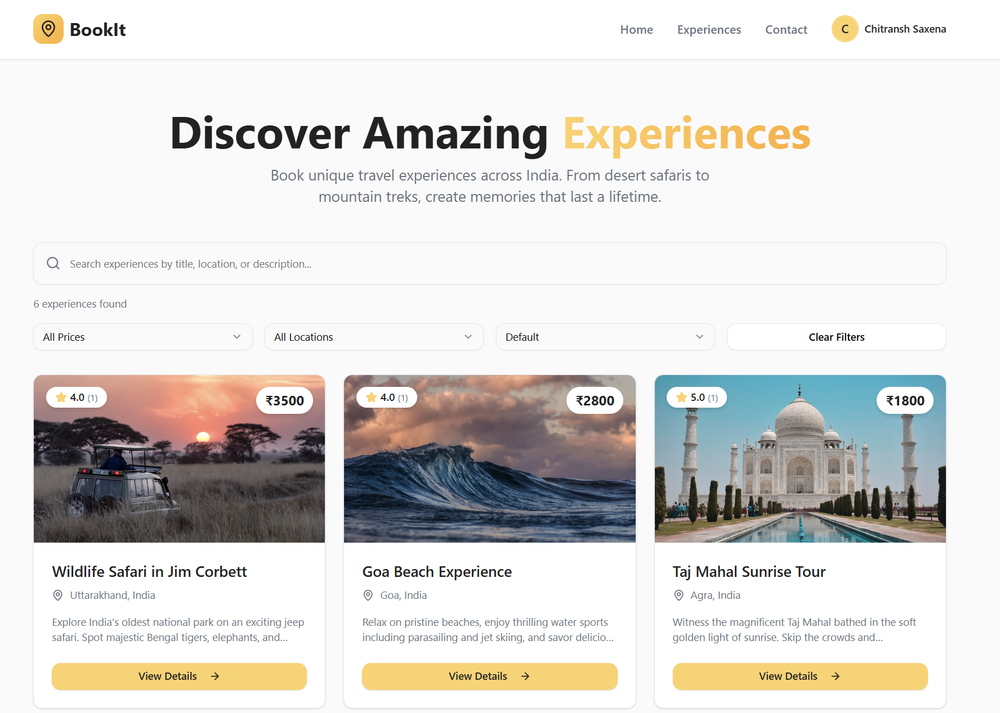
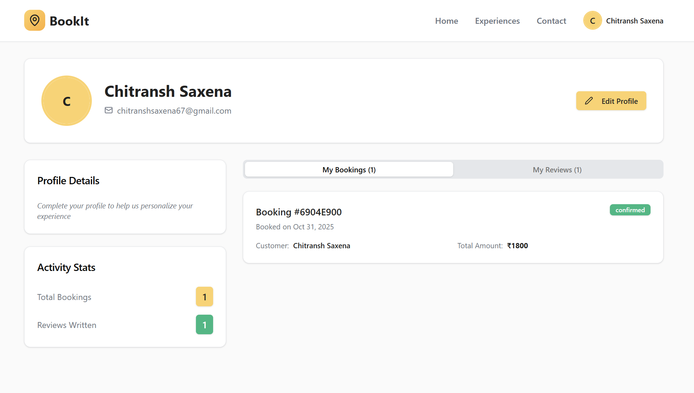
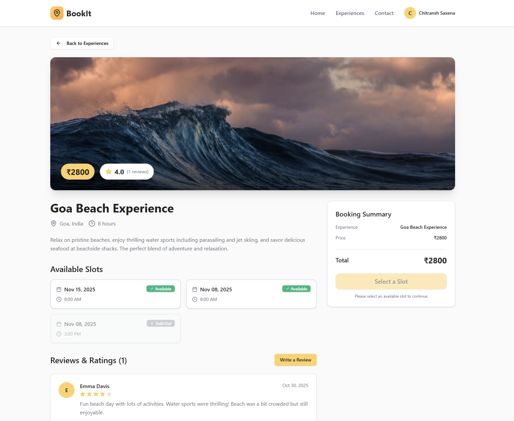
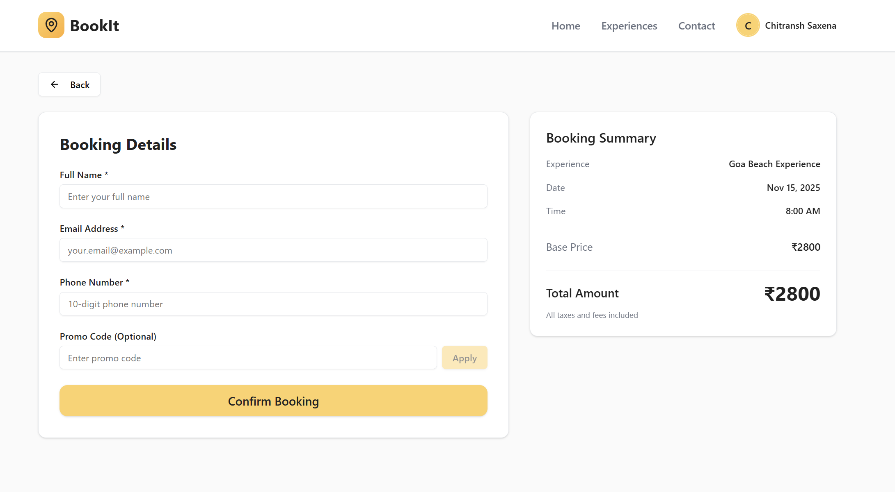

# Bookit Fullstack Application

## Overview

Bookit is a comprehensive fullstack booking platform designed to streamline the experience reservation and management process. The application leverages modern web technologies to deliver a seamless, responsive user interface with efficient state management and API integration. This project demonstrates proficiency in React ecosystem development, component-based architecture, and RESTful API consumption.

### Key Technical Achievements

- Implemented modern React architecture with functional components and custom hooks for optimal state management
- Integrated TanStack Query (React Query) for efficient server state management and caching strategies
- Developed a fully responsive user interface utilizing Tailwind CSS utility-first framework and Radix UI primitives
- Constructed a robust routing system with React Router v6 for seamless navigation and dynamic route handling
- Engineered reusable component library following atomic design principles with shadcn/ui integration
- Optimized build performance and development experience using Vite as the build tool and development server

## Technology Stack


## Screenshots









## Features

- **Home Page**: Browse available experiences and slots
- **Experience Details**: View detailed information about specific experiences, including reviews
- **Booking System**: Confirm and manage bookings with a streamlined checkout process
- **User Profile**: Manage personal information and booking history
- **Responsive Design**: Built with Tailwind CSS for a modern, mobile-friendly interface

## Technical Stack Details

- **Frontend Framework**: React 18+ with modern hooks and concurrent features
- **Build Tool**: Vite for lightning-fast HMR and optimized production builds
- **Styling**: Tailwind CSS with PostCSS for utility-first responsive design
- **UI Components**: Radix UI primitives with shadcn/ui component library
- **State Management**: React hooks with TanStack Query for server state
- **Routing**: React Router DOM v6 for declarative routing
- **Date Handling**: date-fns for efficient date manipulation
- **Utilities**: clsx and tailwind-merge for dynamic className composition
- **Icons**: Lucide React for consistent iconography

## Installation and Setup

Follow these steps to set up the development environment:

1. Clone the repository:
   ```bash
   git clone https://github.com/CSroseX/Bookit-fullstack-application.git
   cd Bookit-fullstack-application
   ```

2. Install project dependencies:
   ```bash
   npm install
   ```

3. Launch the development server:
   ```bash
   npm run dev
   ```

4. Access the application at `http://localhost:5173` (default Vite port)

## Usage Guide

- **Browse Experiences**: Navigate through the home page to explore available experiences and time slots
- **View Details**: Select any experience to access comprehensive information including user reviews and availability
- **Book Experience**: Proceed through the streamlined checkout process to confirm your reservation
- **Manage Profile**: Access your user profile to update personal information and review booking history
- **Responsive Interface**: Enjoy seamless experience across desktop, tablet, and mobile devices

## Build and Development Commands

- `npm run dev` - Start development server with hot module replacement
- `npm run build` - Create optimized production build
- `npm run preview` - Preview production build locally
- `npm run lint` - Run ESLint for code quality checks

